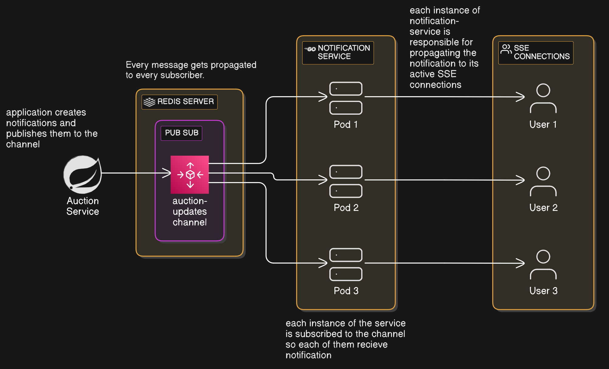

# Real-time Notification System Architecture

## Overview
When I set out to design the notification system, I needed an architecture that could handle thousands of concurrent connections without breaking a sweat. The solution combines Redis Pub/Sub, Golang, and Server-Sent Events (SSE) in a way that's both elegant and powerful.

## System Components

### 1. The Event Source: Auction Service 
Everything starts with our auction service. When something interesting happens — maybe someone places a new bid or an auction is about to close — this service creates a notification and publishes it to Redis. Think of it as the town crier of our digital marketplace.

### 2. The Message Broker: Redis Server
At the center of our system sits Redis, running in Pub/Sub mode. Redis was chosen for its lightning-fast performance and battle-tested reliability. It hosts a channel called "auction-updates" where all our notifications flow through. The beauty of Redis Pub/Sub is that it handles all the heavy lifting of message distribution for us.

### 3. The Distribution Layer: Notification Service
This is where things get interesting. The notification service runs as multiple pods (think of them as independent workers), each capable of handling numerous client connections. Each pod subscribes to our Redis channel and maintains its own set of SSE connections with users.

### 4. The Final Mile: SSE Connections
Server-Sent Events (SSE) provide the highway for delivering updates to users' browsers. Unlike WebSocket connections, SSE is specifically designed for server-to-client communication, making it perfect for our use case.

## Data Flow
The system follows a straightforward but effective flow:

1. Something happens in an auction (new bid, price update, etc.)
2. The auction service publishes this update to Redis
3. Redis broadcasts the message to all notification service pods
4. Each pod delivers the update to its connected users via SSE

## Scalability
What makes this design particularly effective is how it handles scale. Thanks to Golang's Goroutines, each SSE connection consumes minimal resources. This means a single pod can handle thousands of connections without breaking a sweat. Need to support more users? Just spin up more pods.

## Key Benefits

1. **Resource-Efficient**
   - Goroutines are incredibly lightweight compared to traditional threads
   - Memory usage is in kilobytes versus megabytes per connection

2. **Horizontal Scalability**
   - Easy to scale by adding more notification service pods
   - System scales almost linearly

3. **High Availability**
   - Pods operate independently
   - Single pod failure only affects a portion of users
   - Quick reconnection to other pods possible

4. **Low Latency**
   - Updates flow through the system in milliseconds
   - Real-time delivery from event to user screen

## Implementation Considerations
This pattern is worth considering for anyone building a real-time notification system. It's simple enough to implement quickly but sophisticated enough to handle serious scale when needed.
